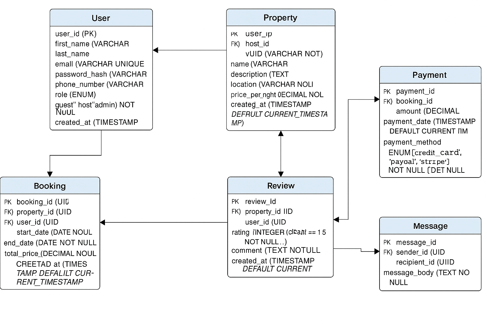

Entities, Attributes, and Keys
1. User
user_id (PK, UUID, Indexed)

first_name (VARCHAR, NOT NULL)

last_name (VARCHAR, NOT NULL)

email (VARCHAR, UNIQUE, NOT NULL)

password_hash (VARCHAR, NOT NULL)

phone_number (VARCHAR, NULL)

role (ENUM: guest, host, admin, NOT NULL)

created_at (TIMESTAMP, DEFAULT CURRENT_TIMESTAMP)

2. Property
property_id (PK, UUID, Indexed)

host_id (FK → User.user_id)

name (VARCHAR, NOT NULL)

description (TEXT, NOT NULL)

location (VARCHAR, NOT NULL)

pricepernight (DECIMAL, NOT NULL)

created_at (TIMESTAMP, DEFAULT CURRENT_TIMESTAMP)

updated_at (TIMESTAMP, ON UPDATE CURRENT_TIMESTAMP)

3. Booking
booking_id (PK, UUID, Indexed)

property_id (FK → Property.property_id)

user_id (FK → User.user_id)

start_date (DATE, NOT NULL)

end_date (DATE, NOT NULL)

total_price (DECIMAL, NOT NULL)

status (ENUM: pending, confirmed, canceled, NOT NULL)

created_at (TIMESTAMP, DEFAULT CURRENT_TIMESTAMP)

4. Payment
payment_id (PK, UUID, Indexed)

booking_id (FK → Booking.booking_id)

amount (DECIMAL, NOT NULL)

payment_date (TIMESTAMP, DEFAULT CURRENT_TIMESTAMP)

payment_method (ENUM: credit_card, paypal, stripe, NOT NULL)

5. Review
review_id (PK, UUID, Indexed)

property_id (FK → Property.property_id)

user_id (FK → User.user_id)

rating (INTEGER, CHECK rating BETWEEN 1 AND 5, NOT NULL)

comment (TEXT, NOT NULL)

created_at (TIMESTAMP, DEFAULT CURRENT_TIMESTAMP)

6. Message
message_id (PK, UUID, Indexed)

sender_id (FK → User.user_id)

recipient_id (FK → User.user_id)

message_body (TEXT, NOT NULL)

sent_at (TIMESTAMP, DEFAULT CURRENT_TIMESTAMP)

Relationship

1. User ↔ Property
A User (as a host) can own many Properties.

Each Property is owned by one User (via host_id).

 Cardinality:
User (1) → (∞) Property

2. User ↔ Booking
A User (as a guest) can make many Bookings.

Each Booking is linked to one User.

 Cardinality:
User (1) → (∞) Booking

3. User ↔ Review
A User can write many Reviews.

Each Review is written by one User.

 Cardinality:
User (1) → (∞) Review

4. User ↔ Message
A User can send and receive many Messages.

Each Message has a sender_id and a recipient_id.

 Cardinality:
User (1) → (∞) Message (as sender or recipient)

5. Property ↔ Booking
A Property can be booked many times.

Each Booking is for one Property.

 Cardinality:
Property (1) → (∞) Booking

6. Property ↔ Review
A Property can have many Reviews.

Each Review is linked to one Property.

 Cardinality:
Property (1) → (∞) Review

7. Booking ↔ Payment
A Booking can have only one Payment.

Each Payment is for one Booking.

 Cardinality:
Booking (1) → (1) Payment (1-to-1)

8. User (host) ↔ Booking (indirect)
Through Property → Booking, a User as host can have Bookings on their property.

This is indirect, via the Property entity.

 Cardinality:
User (host) (1) → (∞) Booking via Property

Visual Representation of your ER Diagram.

